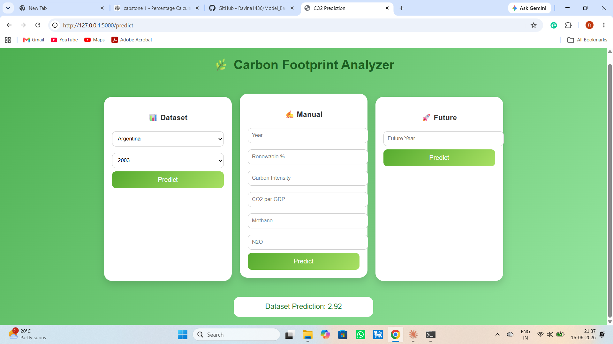
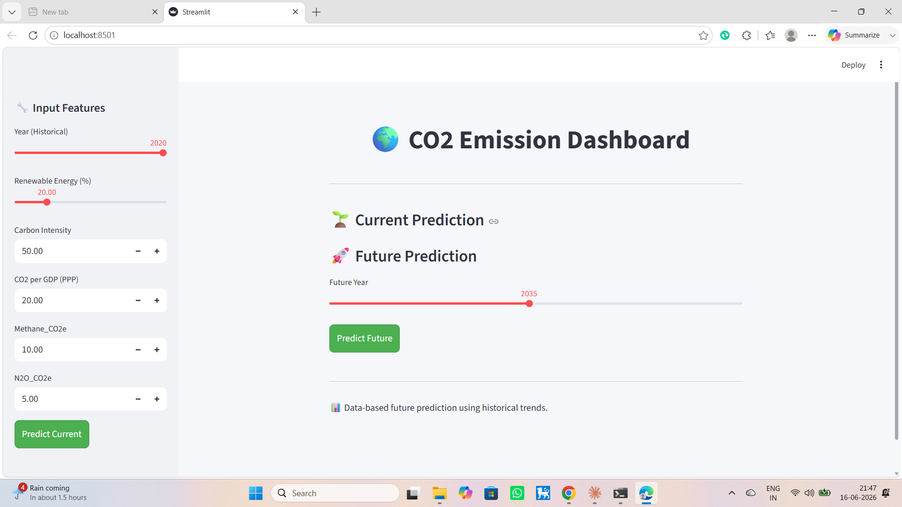

# 🌍 Model-Based Capstone ML Project

## 📌 Project Overview
This capstone project analyzes the relationship between CO₂ emissions and renewable energy consumption across countries using machine learning techniques. The goal is to understand key drivers of emissions and build a predictive model for CO₂ per capita.

## 🎯 Research Question
How do renewable energy consumption and other emission-related factors (CO₂ intensity, CO₂ per GDP (PPP), methane emissions, and nitrous oxide emissions) impact CO₂ emissions per capita across countries over time?

## 📊 Dataset Description
- **Source:** World Bank datasets
- **Time Period:** 1990 – 2020
- **Key Features:**
  - CO₂ per capita (Target)
  - Renewable Energy Consumption (%)
  - CO₂ Intensity
  - CO₂ per GDP (PPP)
  - Methane (CO₂e)
  - Nitrous Oxide (CO₂e)

## 🧹 Data Preparation
- Merged multiple datasets
- Removed irrelevant regions and missing values
- Converted data types and handled null values using median imputation
- Final dataset prepared for modeling and analysis

## 🤖 Models Used
**Baseline Models**
- Linear Regression
- Decision Tree

**Advanced Models**
- Random Forest Regressor ✅ (Best Model)
- Gradient Boosting

## ⚙️ Model Optimization
- Hyperparameter tuning using GridSearchCV
- Cross-validation (5-fold) for model stability
- Best parameters: `n_estimators=200`, `max_depth=None`, `min_samples_split=2`, `min_samples_leaf=1`

## 📈 Results & Evaluation
| Model | R² Score | MAE | RMSE |
|---|---|---|---|
| Linear Regression | 0.568 | 9.22 | 40.79 |
| **Random Forest ✅** | **0.998** | **0.64** | **2.04** |
| Gradient Boosting | 0.997 | 2.01 | 3.26 |

👉 Random Forest performed best with the highest accuracy and lowest error.

## 📊 Key Insights
- Renewable energy has a negative but weak correlation with CO₂ emissions
- Economic factors like CO₂ per GDP are the strongest predictors
- Emissions are influenced by multiple interacting variables, not just renewables

## 🧪 Hypothesis Testing
**Pearson Correlation Test**
- Result: Weak negative relationship between renewable energy and CO₂
- Statistically significant (p-value < 0.05)

## 🚀 Model Deployment
The trained model was deployed using **two different interfaces** to compare deployment approaches:

### 🔹 Flask Web App
A multi-section web app with three prediction modes — historical dataset lookup, manual feature input, and future year forecasting.

📂 [`/flask_app`](./flask_app)

**To run locally:**
```bash
cd flask_app
pip install -r requirements.txt
python app.py
```
Then open `http://127.0.0.1:5000` in your browser.

### 🔹 Streamlit Dashboard
An interactive dashboard with slider/number inputs for current and future CO₂ emission predictions.

📂 [`/streamlit_app`](./streamlit_app)

**To run locally:**
```bash
cd streamlit_app
pip install -r requirements.txt
streamlit run streamlit_app.py
```

## 🖼️ Screenshots

**Flask App**


**Streamlit App**


## 🛠️ Technologies Used
- Python (Pandas, NumPy, Scikit-learn)
- Machine Learning Models (Linear Regression, Decision Tree, Random Forest, Gradient Boosting)
- Flask & Streamlit (Deployment)
- Jupyter Notebook / Google Colab
- GitHub

## 📁 Repository Structure
```
Model_Based_Capstone_ML/
├── flask_app/              # Flask web application
│   ├── app.py
│   ├── templates/
│   ├── rf_model.pkl
│   └── scaler.pkl
├── streamlit_app/          # Streamlit dashboard
│   └── streamlit_app.py
├── screenshots/            # UI screenshots
├── model_based_capstone.ipynb   # Full analysis & model training notebook
├── Capstone_Report_CO2_Group12.Final.pdf
├── Analyzing the Drivers of CO₂ Emissions_Final.pptx
├── *.csv                    # Datasets
└── README.md
```

## 📌 Conclusion
Renewable energy alone cannot significantly reduce emissions. Multiple environmental and economic factors must be considered together, and machine learning models effectively capture these complex relationships.

## 🔮 Future Work
- Include more features like population and industrial data
- Try deep learning models with larger datasets
- Cloud deployment of both apps
- Real-time data integration

## 👩‍💻 Contributors
Ravina — Group Leader & Group Members
